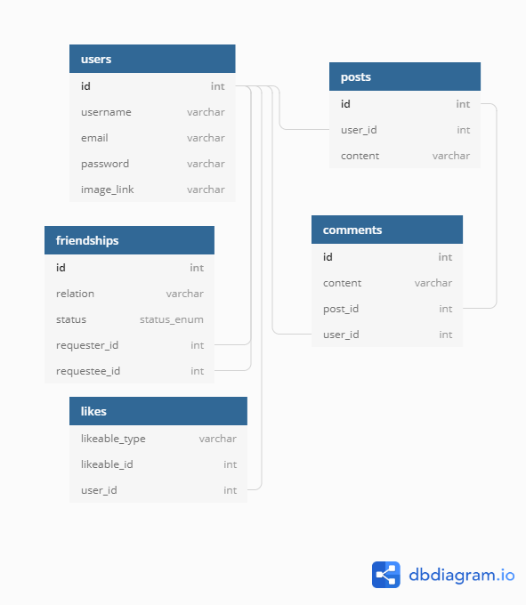

# Cakebook 🧁

### Authors: [Mauricio Robayo](https://github.com/MauricioRobayo) & [Oscar Nava](https://github.com/oscarnava/)

A Facebook wannabe: Some of the core features of the platform – users, profiles, “friending”, posts, news feed, and “liking”
. We’ll also implement sign-in with the real Facebook by using Omniauth and Devise.

[Live version 🧁](https://desolate-retreat-14705.herokuapp.com/).

## ERD

### Setup demo data

To populate the database with the demo data, run `rails db:seed`.

[Assignment link](https://www.theodinproject.com/courses/ruby-on-rails/lessons/final-project).
